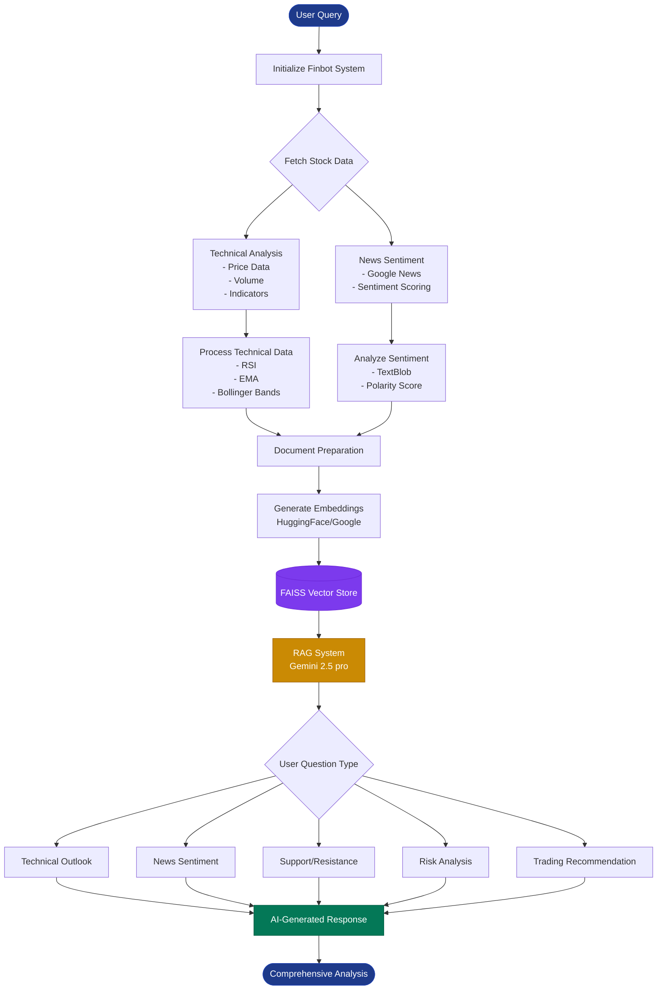
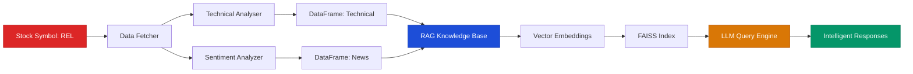
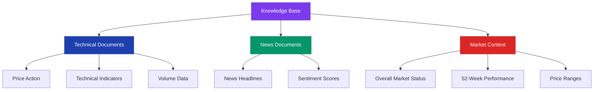

# 🤖 Finbot - AI-Powered Stock Analysis System

An intelligent stock analysis system that combines technical indicators, news sentiment analysis, and RAG (Retrieval-Augmented Generation) to provide comprehensive stock insights.

## 📊 System Architecture



## 🔄 Data Flow



## ✨ Features

### 📈 Technical Analysis
- **RSI (Relative Strength Index)**: Overbought/oversold indicators
- **EMA (Exponential Moving Average)**: Trend direction signals
- **Bollinger Bands**: Volatility and price range analysis
- **Volume Analysis**: Trading activity patterns
- **Support/Resistance Levels**: Key price levels

### 📰 News Sentiment Analysis
- Real-time news fetching from Google News
- Sentiment scoring using TextBlob
- Contextual impact analysis
- Recent 7-day news aggregation

### 🤖 RAG-Powered Intelligence
- **Retrieval-Augmented Generation**: Combines LLM with stock-specific knowledge
- **Context-Aware Responses**: References actual data points
- **Multi-Source Analysis**: Synthesizes technical + sentiment data
- **Explainable AI**: Provides reasoning for recommendations

## 🚀 Getting Started

### Prerequisites

```bash
pip install langchain langchain-google-genai langchain-community
pip install faiss-cpu sentence-transformers
pip install pandas numpy python-dotenv
```

### Environment Setup

Create a `.env` file:
```env
GOOGLE_API_KEY=your_gemini_api_key_here
```

### Basic Usage

```python
from finbot import StockAnalysisRAG
import os

# Initialize the system
GEMINI_API_KEY = os.environ['GOOGLE_API_KEY']
rag_system = StockAnalysisRAG(
    gemini_api_key=GEMINI_API_KEY,
    use_local_embeddings=True
)

# Build knowledge base
rag_system.build_knowledge_base(df_technical, df_news, analysis_report)

# Query the system
result = rag_system.query("What is the current technical outlook for REL stock?")
print(result['answer'])

# Get trading recommendation
recommendation = rag_system.get_trading_recommendation()
print(recommendation)
```

## 🔧 Configuration

### LLM Settings
```python
self.llm = ChatGoogleGenerativeAI(
    model="gemini-2.5-pro",
    temperature=0.3,           # Lower = more focused
    max_output_tokens=8192     # Response length limit
)
```

### Embedding Options
```python
# Option 1: Local (Free, Offline)
use_local_embeddings=True  # HuggingFace sentence-transformers

# Option 2: Cloud (Requires API quota)
use_local_embeddings=False  # Google Embeddings
```

### Retrieval Parameters
```python
search_kwargs={"k": 8}  # Number of relevant documents to retrieve
chunk_size=1500         # Document chunk size
chunk_overlap=300       # Overlap between chunks
```

## 📚 Components

### StockAnalysisRAG Class

#### Key Methods

| Method | Description |
|--------|-------------|
| `build_knowledge_base()` | Processes and indexes all stock data |
| `query()` | Ask specific questions about the stock |
| `get_trading_recommendation()` | Get comprehensive AI analysis |
| `save_vectorstore()` | Persist vector store to disk |
| `load_vectorstore()` | Load pre-built vector store |

### Document Types



## 🎯 Use Cases

### 1. Daily Trading Insights
```python
result = rag_system.query("Should I be concerned about the current RSI value?")
```

### 2. News Impact Analysis
```python
result = rag_system.query("How is recent news sentiment affecting the stock?")
```

### 3. Technical Level Identification
```python
result = rag_system.query("What are the key support and resistance levels?")
```

### 4. Risk Assessment
```python
recommendation = rag_system.get_trading_recommendation()
```

## 📊 Sample Questions

- "What is the current technical outlook for REL stock?"
- "How is the news sentiment affecting the stock?"
- "What are the key support and resistance levels?"
- "Should I be concerned about the current RSI value?"
- "What is the overall market sentiment based on recent news?"
- "Is the stock showing bullish or bearish momentum?"
- "What are the main risk factors to consider?"

## ⚠️ Important Notes

### Limitations
- **Not Financial Advice**: This system provides analysis, not investment recommendations
- **Data Freshness**: Analysis is based on available historical and recent data
- **Market Volatility**: Past performance doesn't guarantee future results
- **API Costs**: Google Gemini API usage incurs costs

### Best Practices
1. ✅ Always verify AI insights with multiple sources
2. ✅ Use as one tool in your analysis toolkit
3. ✅ Understand technical indicators before acting
4. ✅ Consider your risk tolerance and investment goals
5. ✅ Consult with financial advisors for major decisions

## 🔒 Security

- Store API keys in `.env` file (never commit to version control)
- Add `.env` to `.gitignore`
- Use environment variables for sensitive data
- Regularly rotate API keys

## 📈 Performance Optimization

### Vector Store Caching
```python
# Save for reuse
rag_system.save_vectorstore("stock_vectorstore")

# Load cached version
rag_system.load_vectorstore("stock_vectorstore")
```

### Embedding Strategy
- **Local embeddings**: Faster, no API costs, works offline
- **Cloud embeddings**: Higher quality, requires internet and quota

## 🤝 Contributing

Contributions welcome! Please ensure:
- Code follows PEP 8 style guidelines
- Add docstrings to new functions
- Update README for new features
- Test thoroughly before submitting PR

## 📄 License

MIT License - feel free to use and modify for your projects

## 🙏 Acknowledgments

- **LangChain**: RAG framework
- **Google Gemini**: LLM capabilities
- **FAISS**: Efficient vector search
- **HuggingFace**: Embedding models

## 📞 Support

For issues or questions:
- Open a GitHub issue
- Check documentation at `/docs`
- Review example notebooks in `/examples`

---

**⚠️ Disclaimer**: This tool is for educational and informational purposes only. Always do your own research and consult with qualified financial advisors before making investment decisions.

**Made with ❤️ for smarter stock analysis**